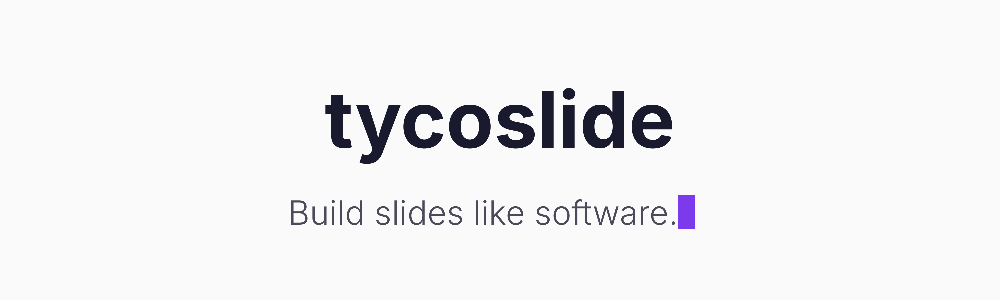
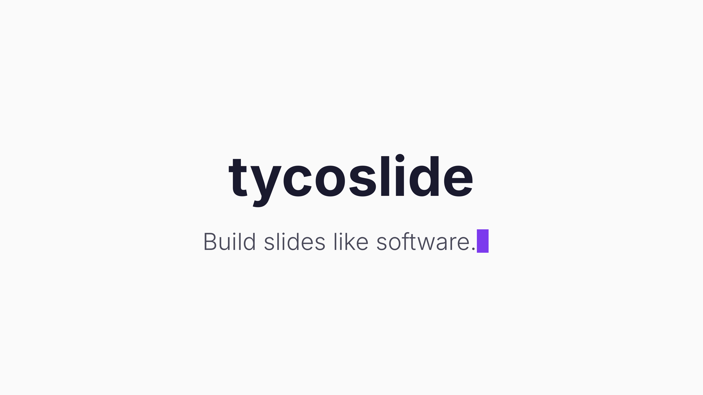
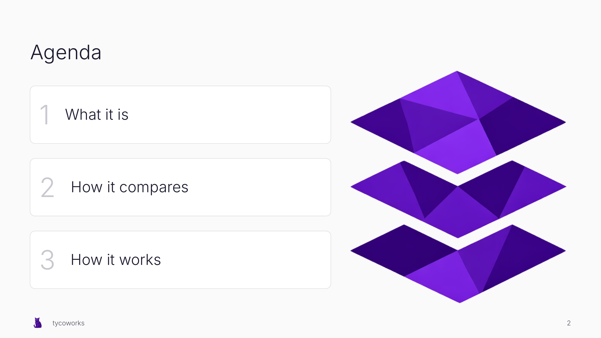
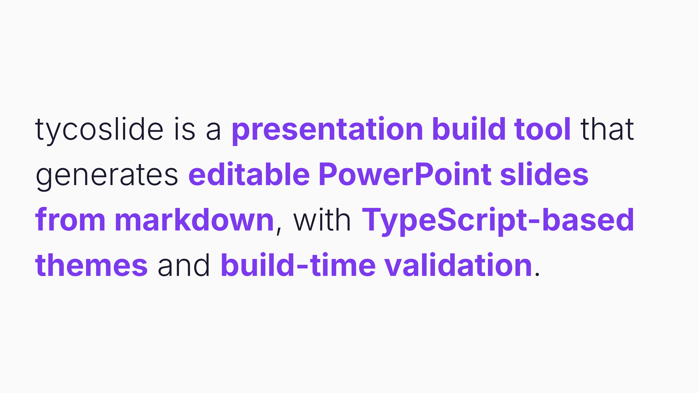
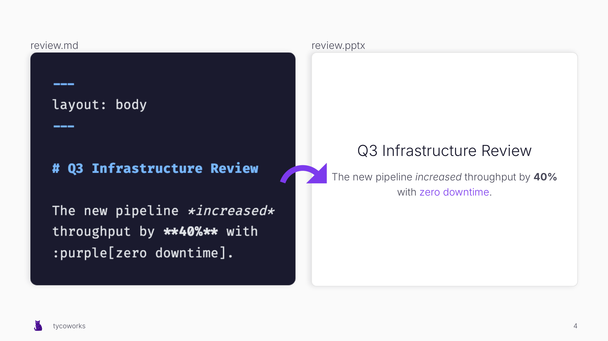
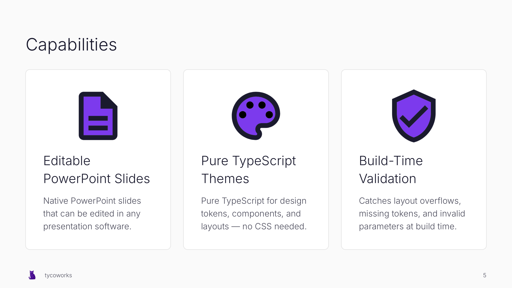
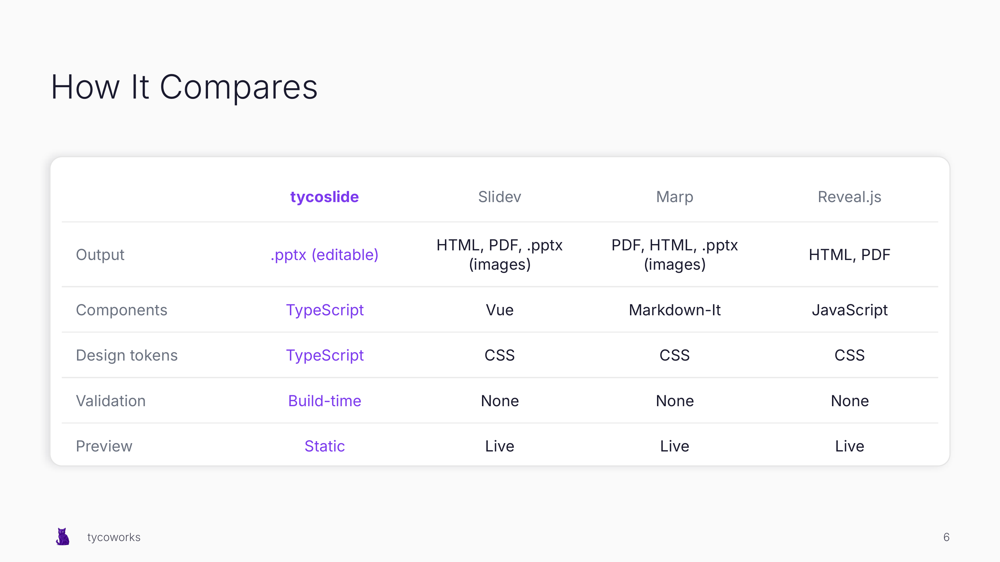
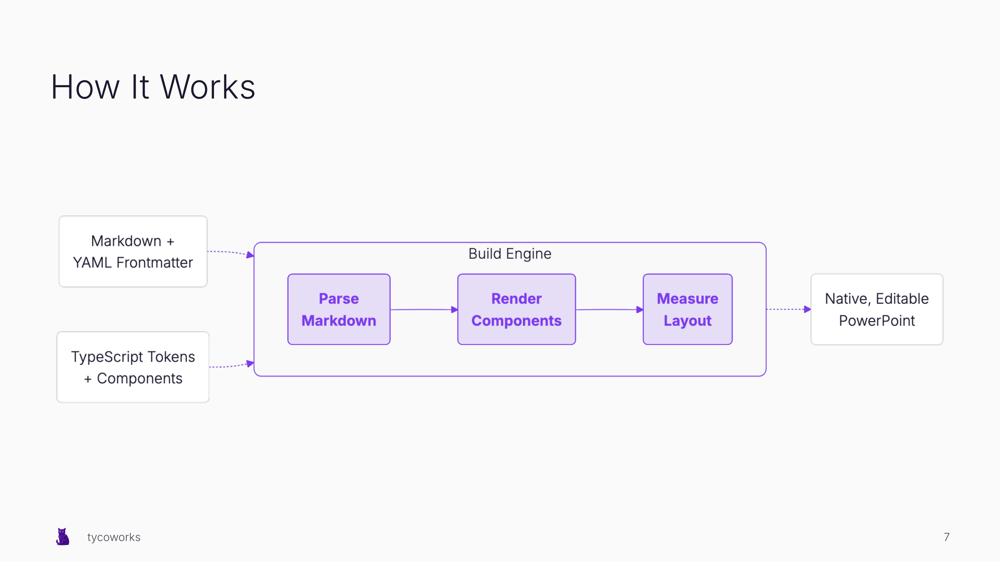
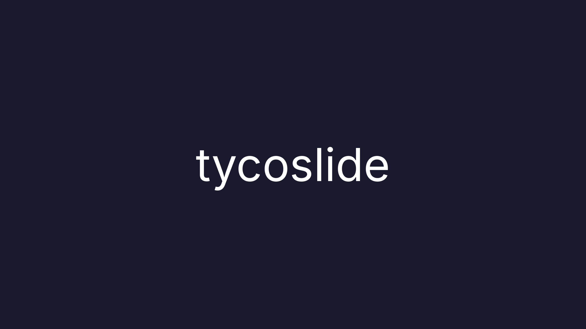

<p align="center">
  
</p>

Create editable PowerPoint slides from markdown, with TypeScript-based themes and build-time validation.

> **Early release (v0.2.0)** — tycoslide is under active development. The API may change between minor versions.

**Why tycoslide?**
- **Editable PowerPoint slides**: Native .pptx files that open in PowerPoint, Keynote, or Google Slides
- **Pure TypeScript themes**: Design tokens, layouts, and components defined in TypeScript — no CSS needed
- **Build-time validation**: Catches missing tokens, invalid layouts, and content overflow as build errors

**[About tycoslide →](./docs/about.md)** — how it works, how it compares, and FAQs.

## Examples

Slides created from the default theme:

<table>
<tr>
<td></td>
<td></td>
<td></td>
<td></td>
</tr>
<tr>
<td></td>
<td></td>
<td></td>
<td></td>
</tr>
</table>

## Quick Start

Create a new project and install tycoslide:

```bash
mkdir my-slides && cd my-slides
npm init -y
npm install @tycoslide/cli @tycoslide/theme-default
npx playwright-core install chromium
```

Create `slides.md`:

```markdown
---
theme: "@tycoslide/theme-default"
---

---
layout: title
variant: default
title: My Presentation
subtitle: Built with tycoslide
---

---
layout: body
variant: default
title: First Slide
eyebrow: INTRODUCTION
---

Your content goes here.
```

Build your presentation:

```bash
npx tycoslide build slides.md
```

Output: `slides.pptx` — ready to open and present.

See [examples/showcase.md](./examples/showcase.md) for a full-featured deck with cards, tables, mermaid diagrams, and more.

**[Full quick start guide →](./docs/quick-start.md)**

## Documentation

**[Read the documentation →](./docs/)**

Covers markdown syntax, components, layouts, themes, CLI usage, and troubleshooting.

## Community

[Join the Discord](https://discord.gg/r5qCW8aBEy)

## License

[MIT](./LICENSE)
