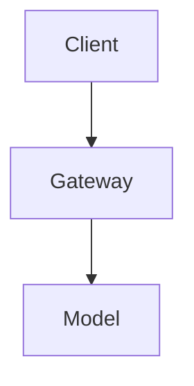

# tycoslide

tycoslide wraps existing .pptx files with a markdown layer, so you can create editable, on-brand decks from the command line or agent skills.

> **Early release.** tycoslide is under active development.

## Getting started

1. **Create a tycoslide theme.** Install the [create-theme](skills/create-theme) skill (`npx skills add tycoworks/tycoslide`) and give the agent your `.pptx`. You'll get back an npm package of mapped layouts, colors, and visual assets, like the [tycoworks-theme](https://github.com/tycoworks/tycoworks-theme).
2. **Write slides in markdown.** Bullets, tables, images, speaker notes, syntax-highlighted code and mermaid diagrams are all supported. Every theme comes with an agent skill, so an agent can write the markdown for you.
3. **Build.** `npx tycoslide build deck.md` compiles the markdown into an editable PowerPoint file.

## Example

[tycoworks-theme](https://github.com/tycoworks/tycoworks-theme) is a finished theme wrapping `template/tycoworks-demo.pptx`. Clone it and build its showcase deck, 21 slides covering all 18 layouts:

```bash
git clone https://github.com/tycoworks/tycoworks-theme && cd tycoworks-theme
npm install
npx tycoslide build showcase.md
```

A deck file against that theme looks like this (full syntax in [syntax.md](theme-package/syntax.md)):

````markdown
---
theme: ./theme.json
---

---
layout: Title
title: Quarterly Review
name: Jane Doe
jobTitle: Engineering
---

---
layout: Image right
title: How requests flow
---

::body::

- Every request is checked before it reaches the model
- Rejected requests never leave the gateway

::image::


```mermaid
flowchart TD
  A[Client] --> B[Gateway] --> C[Model]
```

---
layout: Code
title: Calling the API
---

::code::

```python
client = Client(api_key)
deck = client.build("deck.md")
```
````

## Requirements

Node 23.6 or later. Mermaid diagrams need Chrome on the machine; tycoslide finds an installed one, or run `npx playwright install chromium-headless-shell`.
