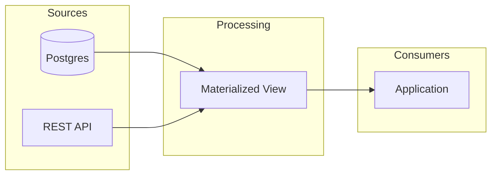

# Markdown Syntax Reference

This document covers the detailed syntax for writing slide content in tycoslide deck files.

> **Every layout, parameter, and slot name in the examples below is a placeholder.** Your theme's real names live in `theme.json` — read it first, and never assume a name shown here (`Body`, `TwoColumn`, `hero`, `::left::`, etc.) exists in your theme.

---

## File structure

A deck file has three parts:

1. **Global frontmatter** (required) -- the first `---`-delimited block.
2. **Slides** -- each begins with a `---` separator. A slide's frontmatter sits between `---` delimiters. Body content follows the closing `---`.
3. **Slide separators** -- a `---` on its own line separates slides.

## Global frontmatter

Every deck file starts with a global frontmatter block declaring the theme:

```markdown
---
theme: ./theme.json
---
```

- **`theme`** (required) -- path to the theme config file, relative to the deck file.

The output `.pptx` is written next to the deck file, named after it (`deck.md` → `deck.pptx`).

## Slide frontmatter

Every slide must have a `layout:` key. All other frontmatter keys map 1:1 to the layout's **parameters**. A value containing a colon-then-space must be quoted -- `title: "The change: compute on the difference"` -- or YAML reads it as a second key and the build fails.

```yaml
---
layout: Body
title: Key Achievements
subtitle: This Quarter
---
```

- `layout` is required and consumed by the compiler (not forwarded as content).
- All other frontmatter keys fill parameters: `title` fills the `title` parameter, `subtitle` fills the `subtitle` parameter, etc.
- Slots (accepting `text`, `table`, `image`) are filled by body regions, not frontmatter -- see below.
- A slide may also carry a `notes:` block in frontmatter -- plain-text speaker notes for the slide's notes page (see [Speaker notes](#speaker-notes)). It is slide-level metadata, not a parameter or slot.

---

## Body content

A slide's body is split into regions with `::key::` markers. Each region fills the slot whose `key` matches the marker.

```markdown
---
layout: Body            # ← placeholder; use a real layout from your theme
title: Key Achievements
---

::body::

We exceeded targets across all metrics.

- Revenue up 23% quarter-over-quarter
- Customer churn reduced to 1.2%
- Three major product launches completed
```

Write each region as paragraphs and bullets:
- `- ` starts a **bullet**; indent **2 spaces per level** to nest (`  - ` = level 1).
- A line without a `- ` bullet is a **paragraph** (a lead-in / prose line).
- Blank lines are ignored (they're visual separators, not content).
- Do NOT put headings in body content -- the heading is the slide's `title` slot, and a subheading is the `subtitle` slot. Body is paragraphs + bullets only.

### Inline formatting

Inline formatting is supported in body content:
- `**bold**` -- bold text
- `*italic*` -- italic text
- `~~strikethrough~~` -- strikethrough text
- `++underline++` -- underlined text
- `[text](url)` -- hyperlink

---

## Named slots with `::key::` markers

For layouts with multiple content regions (e.g., two-column layouts), use `::key::` markers to split body content into named slots.

```markdown
---
layout: TwoColumn
title: Before & After
---

::left::

- Manual deployments
- 4-hour release cycles
- Frequent rollbacks

::right::

- Automated CI/CD pipeline
- 12-minute releases
- Zero-downtime deploys
```

Content after a marker goes to the slot matching that name. The marker names must match the layout's slot keys.

---

## Parameters and slots

A layout advertises two kinds of author-facing input, split by one rule: **a parameter is one value on a frontmatter line; a slot is a multi-line region in the body** (a `::key::` region).

### Parameter types (frontmatter lines)

Fill a parameter by putting a value under its key in the slide's frontmatter.

- **`template`** -- a shape whose existing runs are walked and replaced in place, preserving each run's style. Behind the scenes each text shape carries one `template` string with `{key}` placeholders (e.g. `{title}`, or `{name}\n{jobTitle}` for a two-line credits shape), but you never see the template: the layout advertises **one key per placeholder**, and you fill each key as a plain scalar in frontmatter. A single-placeholder title shape gives you one key:
  ```yaml
  title: Q3 Results
  ```
  A multi-line credits shape whose template is `{name}\n{jobTitle}` surfaces as two keys -- fill each on its own frontmatter line (never a YAML array):
  ```yaml
  name: Jane Smith
  jobTitle: CEO, Acme Corp
  ```
  The engine substitutes each value into the run that carries its style, so if the designer made the name bold and the job title grey, the filled name stays bold and the filled title stays grey.
### Body content shapes

Fill a slot by writing a `::key::` region in the body; the marker maps to the slot with that `key`. A slot lists which content types it `accepts` (`text`, `table`, `image`) -- write content whose shape matches one of them:

- **text** (slots that accept `text`) -- markdown paragraphs and bullets, rebuilt from the template's specimen paragraph styles. A fenced code block also routes here:
  ````markdown
  ::code::

  ```sql
  SELECT name, total
  FROM orders
  WHERE created_at > now() - INTERVAL '5 minutes';
  ```
  ````
  The language tag (e.g. `sql`, `python`, `typescript`) is required -- it drives syntax highlighting, using the theme's `codeTheme` (set once in `theme.json`, not per slot). Colors are applied as native text runs in the output, not images.
- **table** (slots that accept `table`) -- a GFM table. Write it in the slot region between `|`-delimited headers and rows; cells inherit inline formatting (bold, italic, links).
- **image** (slots that accept `image`) -- an image, written as `` with the path relative to the deck:
  ```markdown
  ::logo::

  
  ```
  The alt text becomes the image's alt text in PowerPoint; leave it empty for an image that is only decoration. The slot's `fit`, set in the theme, decides how the image fills its shape. A fenced `mermaid` block also fills an image slot, rendering to a themed PNG (see below).

---

## Mermaid diagrams

Write a fenced code block with the `mermaid` language tag in a named slot that accepts `image`. It renders to a themed PNG and fills the slot like any other image, by the slot's `fit`. The color variant comes from the theme's `mermaidVariant` (set once in `theme.json`, not per slot).

````markdown
---
layout: Diagram
title: System Architecture
---

::image::


````

### Semantic grouping

Use `class` statements to group nodes by meaning. Nodes sharing a group name share a color, assigned automatically from the theme's accent color pool.

```
class DB,API sources       # DB and API belong to the "sources" group
class MV processing        # MV belongs to the "processing" group
```

Inline syntax also works: `A:::groupName`.

Group names are arbitrary -- they describe what nodes mean, not what color they get. Colors are assigned round-robin in encounter order. Unclassed nodes use the theme's primary color.

### Forbidden directives

The theme owns all styling. These directives are rejected at build time:

- `style` -- use `class` instead
- `linkStyle` -- link colors come from the theme
- `classDef` -- class definitions are auto-generated from the theme
- `%%{init}` -- theme configuration is set by the engine

---

## Layout declarations

Each parameter or slot in the layout definition may declare:
- **`accepts`** (slots, required) -- an array of `text`, `table`, `image`.
- **`required: true`** -- the slide has no usable default and the build fails if the parameter/slot has no value.
- **optional (the default)** -- a parameter or slot you leave unfilled is dropped from the slide (its shape is removed), so a layout with numbered slots (e.g. up to six sections, up to four stats) renders only the ones you fill.

Each layout also declares a `slideNumber` pointing at the physical slide in the theme's template -- unique per layout (one layout maps to one physical slide).

---

## Speaker notes

Any slide may carry a `notes:` key in its frontmatter -- a plain-text speaker-notes block attached to that slide's notes page. It is slide-level metadata, not a parameter or a slot: it is never routed to a shape and never appears on the slide face, only in the presenter/notes view.

Write multiple lines with a YAML block scalar (`|`); each line becomes one notes paragraph. Template notes on the underlying slide are always stripped, so only what you author here shows up.

```yaml
---
layout: Body
title: Key Achievements
notes: |
  Open by thanking the regional teams.
  Land the 23% number, then pause before the churn stat.
---
```

To build with all speaker notes omitted, pass `--no-notes` to `npx tycoslide build`.

---

## Slides with no body

Slides that have all their content in frontmatter (common for title slides, section dividers) need no body:

```markdown
---
layout: SectionDivider
title: Part Two
subtitle: Advanced Topics
---
```

---

## Build

Build the deck (replace `<deck.md>` with your deck file):

```bash
npx tycoslide build <deck.md>
```

Common errors and fixes:

| Error | Fix |
|-------|-----|
| `unknown layout "xyz"` | Check layout names in `theme.json` |
| A parameter or slot didn't fill | Use the key names the layout declares -- parameters in frontmatter, slots as body regions |
| YAML parse error | Fix the YAML syntax in the slide's frontmatter |
| `image "…" not found at …` | Check the path; it is relative to the deck file |
| `Skipped setting relation target` | The asset image couldn't be placed; check the path and file |
| `forbidden style directive` | Remove `style`, `classDef`, `linkStyle`, or `%%{init}` from your mermaid block -- use `class` for grouping instead |
| `no "mermaid" block` | The theme has no mermaid color config -- add a `mermaid` section to theme.json |

---

## Full Example

```markdown
---
theme: ./theme.json
---

---
layout: Title
title: Engineering Onboarding
subtitle: Welcome to the team
---

---
layout: Body
title: Your First Week
---

::body::

Here is what to expect in your first week.

- Day 1: Laptop setup and HR orientation
- Day 2: Meet your team, shadow a standup
- Day 3-5: First starter task
  - Pick from the "good first issue" board
  - Pair with your onboarding buddy

---
layout: TwoColumn
title: Tools We Use
---

::left::

Development:

- GitHub for code
- Linear for tasks
- Slack for chat

::right::

Infrastructure:

- AWS for hosting
- Datadog for monitoring
- PagerDuty for on-call

---
layout: ImageSlide
title: Office Map
---

::hero::


```
