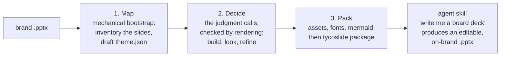

# Creating a theme from an existing PowerPoint

> Status: draft v4 (3 Sep 2026). The manual sampler, in three phases named Map, Decide,
> and Pack. This document sequences the actions, while the concepts behind them live in
> the reference docs. Eventually the procedure becomes a theme-authoring SKILL, where Map
> is what the agent does alone, Decide is the interview, and Pack finishes the job.

## The whole process at a glance

tycoslide builds a deck by filling the shapes of a real PowerPoint template with the
deck's content, then writing the result as a new PowerPoint file that anyone can edit. To
do that, it needs a theme, which is a zip file containing the template itself, a config
file that maps the template's slides and shapes, and any images decks will use. Creating
a theme therefore means writing that config file, checking each layout renders
faithfully, and packaging everything as a skill.

```
my-theme/
  template/brand.pptx    the designer's file, verbatim, never modified
  theme.json             the map, and the only file to author
  package.json           depends on @tycoworks/tycoslide
  assets/                optional picture library
```

The work falls into three phases.



1. **Map** is the mechanical part. Scaffold the directory, read the template's slides and
   shapes out of the file, and draft a `theme.json` from what the placeholder text
   implies. Nothing is decided yet, so everything is a best guess.
2. **Decide** is the human part. Choose which slides deserve to be layouts, what each
   ambiguous shape is, what the authoring vocabulary should be, and what is optional.
   Every decision gets checked the same way, by building a smoke deck and looking at the
   render.
3. **Pack** is the finishing part. Catalog the assets, declare fonts and diagram theming,
   and run one command that turns the directory into a self-contained Agent Skill.

Run as a skill, the same three phases hold. The agent maps alone, runs Decide as an
interview, and packs when the renders pass.

## 1. Map

The goal of this phase is a complete draft, with every slide inventoried and a best-guess
`theme.json` written, but nothing decided yet.

Scaffolding takes a minute.

```bash
mkdir my-theme && cd my-theme
npm init -y && npm install @tycoworks/tycoslide
mkdir template && cp ~/wherever/brand.pptx template/
```

As a shortcut, clone the demo theme and swap in the template, since its `theme.json` is a
worked example of everything below.

Next, inventory the template. A `.pptx` is a zip of XML, so each slide's shapes and their
placeholder text can be listed directly.

```bash
python3 - <<'PY'
import zipfile, re, glob
z = zipfile.ZipFile(glob.glob('template/*.pptx')[0])
for path in sorted((n for n in z.namelist() if re.match(r'ppt/slides/slide\d+\.xml$', n)),
                   key=lambda n: int(re.search(r'\d+', n).group())):
    xml = z.read(path).decode('utf-8')
    print(f"== {path}")
    for name, body in re.findall(
            r'<p:nvSpPr>.*?name="([^"]*)".*?</p:nvSpPr>(.*?)(?=<p:nvSpPr>|</p:spTree>)',
            xml, re.S):
        text = ' '.join(re.findall(r'<a:t>([^<]*)</a:t>', body))[:60]
        print(f"   {name!r:32} {text}")
PY
```

The shape names mean nothing. They are whatever the designer's tool produced, a name like
`Google Shape;877;p95` is normal, and they are never renamed, only referenced. What
matters is each shape's placeholder text, because it says what the shape is for. A shape
holding "Lorem ipsum…" is a body region, "— Firstname Lastname, Job Title" is an
attribution, and "‹#›" is page chrome to ignore. That reading drives the draft. Short,
styled, single-purpose text such as titles, names, and labels becomes a **parameter**,
where the `{key}` substitutes into the designer's existing runs so the styling survives,
and one shape can host several keys (`"{name}\n{jobTitle}"`). Free-form regions whose
content varies in length or kind, such as text bodies, tables, and pictures, become
**slots**, each declaring what it accepts. The reference docs cover both concepts in full.

Draft a layout entry per plausible slide.

```json
{
  "template": "brand.pptx",
  "layouts": [
    {
      "name": "Quote",
      "slideNumber": 40,
      "description": "Large pull-quote with attribution.",
      "parameters": [
        { "shapeName": "Google Shape;877;p95", "template": "{quote}" },
        { "shapeName": "Google Shape;878;p95", "template": "{attributionName}\n{attributionTitle}" }
      ],
      "slots": [
        { "key": "logo",
          "accepts": [{ "type": "image", "sourceSlide": 40, "shapeName": "Google Shape;879;p95" }] }
      ]
    }
  ]
}
```

## 2. Decide

In this phase the draft becomes the theme. Every guess is either confirmed by a render or
corrected by a human. The decisions come up in roughly this order.

- **Which slides stay.** Real templates carry duplicates, retired variants, and one-off
  slides. Keep the patterns worth reusing and delete the rest from the draft.
- **The authoring vocabulary.** Layout names and field keys such as `title`, `quote`, and
  `col1_body` are the words every future deck author, human or agent, will type. Treat
  the naming like API design, because these names are permanent.
- **Ambiguous shapes.** Where placeholder text didn't settle whether a shape is a
  parameter, a slot, or content at all, look at the slide and decide.
- **What's optional.** A slot can be marked `required`, and everything else drops cleanly
  when a deck omits it. A logo on a quote slide usually should be optional, since an
  internal quote doesn't want a company mark implying affiliation.
- **Each layout's description.** Write it for the agent that will use the layout. This is
  the only per-layout guidance channel, and field testing proved it gets read. Capacity
  notes like "comfortably holds four rows", fill order like "sections fill the left
  column first", and quirks like "leave the first header cell blank" all pay for
  themselves.

Every decision gets checked the same way, with a smoke deck per layout, rendered and
looked at.

```markdown
---
theme: theme.json
---

---
layout: Quote
quote: "A short test quote to check position and styling."
attributionName: Jane Doe
attributionTitle: Principal Engineer
---
```

```bash
npx tycoslide build smoke.md
soffice --headless --convert-to pdf smoke.pptx && pdftoppm -png smoke.pdf slide
```

Assume the first build fails. That's normal, because mapping errors, styling surprises,
and spacing issues only show up rendered. Fix the map, rebuild, and look again. Render
with LibreOffice or PowerPoint, since Keynote misrenders some templates, and test with
realistic content lengths, because a slot that looks right with one line can misbehave
with six.

## 3. Pack

The goal of this phase is a self-contained skill an agent can use.

Assets come first, unless the theme uses no pictures. Drop the files under `assets/` and
catalog each one in `theme.json` with a `path`, a `type`, and a `description`. The type
is `icon`, `image`, or `background` and controls how the picture is scaled, which the
reference docs explain. Write the description for search, because agents grep the catalog
for what a picture depicts rather than what they mean by it. The decisions here need a
human. Someone has to say where the source files live, whether in a brand portal, with
the design team, or exported from the website, which variants matter, such as dark, light,
and mono marks, and whether anything shouldn't ship at all, since client logos need the
same sign-off as any public use.

Two optional extras finish the config. `fonts` takes package specifiers like
`@fontsource/inter` or local font files, and `mermaidVariant` sets the color theme for
rendered diagrams. Deck authors get code highlighting and mermaid rendering for free, and
these two knobs are the only theme work behind them.

Then package it.

```bash
npx tycoslide package
```

That generates the layouts manifest, the searchable asset catalog, and `SKILL.md`, and
zips everything into a self-contained bundle ready to upload as an Agent Skill. At that
point, "write me a board deck" in a chat produces an editable `.pptx` in the exact brand.
