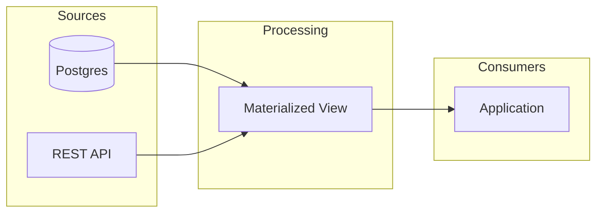

# Markdown Syntax Reference

This document covers the detailed syntax for writing slide content in tycoslide deck files. For an overview of how to create slides, see [SKILL.md](SKILL.md).

---

## Global frontmatter

Every deck file starts with a global frontmatter block declaring the theme:

```markdown
---
theme: ./theme.json
output: my-deck.pptx
---
```

- **`theme`** (required) -- path to the theme config file, relative to the deck file.
- **`output`** -- output filename. Defaults to the deck filename with a `.pptx` extension.

---

## Body content (body slots)

Everything after a slide's closing `---` and before the next slide separator is body content. It maps to the `body` slot as a string array.

```markdown
---
layout: Body
title: Key Achievements
---

We exceeded targets across all metrics.

- Revenue up 23% quarter-over-quarter
- Customer churn reduced to 1.2%
- Three major product launches completed
```

Write body content as paragraphs and bullets:
- `- ` starts a **bullet**; indent **2 spaces per level** to nest (`  - ` = level 1).
- A line with no marker is a **paragraph** (a lead-in / prose line).
- Blank lines are ignored (they're visual separators, not content).
- Do NOT put headings in body content -- the heading is the slide's `title` slot, and a subheading is the `subtitle` slot. Body is paragraphs + bullets only.

### Inline formatting

Inline formatting is supported in body content:
- `**bold**` -- bold text
- `*italic*` -- italic text
- `~~strikethrough~~` -- strikethrough text
- `++underline++` -- underlined text
- `[text](url)` -- hyperlink

---

## Named slots with `::name::` markers

For layouts with multiple content regions (e.g., two-column layouts), use `::name::` markers to split body content into named slots.

```markdown
---
layout: TwoColumn
title: Before & After
---

::left::

- Manual deployments
- 4-hour release cycles
- Frequent rollbacks

::right::

- Automated CI/CD pipeline
- 12-minute releases
- Zero-downtime deploys
```

Content before the first `::name::` marker goes to the `body` slot. Content after a marker goes to the slot matching that name. The marker names must match the layout's slot keys.

---

## Parameters and slots (in `manifest.json`)

A layout advertises two kinds of author-facing input, split by one rule: **a parameter is one value on a frontmatter line; a slot is a multi-line region in the body** (the default region, or a `::name::` region). In `manifest.json` each layout carries two lists, `parameters` and `slots`:

```jsonc
{
  "name": "Feature with code",
  "parameters": [
    { "key": "title",    "type": "template" },
    { "key": "subtitle", "type": "template" },
    { "key": "logo",     "type": "image", "fit": "contain", "required": true }
  ],
  "slots": [
    { "key": "body", "type": "text" },
    { "key": "code", "type": "code", "codeTheme": "github-dark" }
  ]
}
```

### Parameter types (frontmatter lines)

Fill a parameter by putting a value under its key in the slide's frontmatter.

- **`template`** -- a shape whose existing runs are walked and replaced in place, preserving each run's style. Behind the scenes each text shape carries one `template` string with `{key}` placeholders (e.g. `{title}`, or `{name}\n{jobTitle}` for a two-line credits shape), but you never see the template: the manifest advertises **one key per placeholder**, and you fill each key as a plain scalar in frontmatter. A single-placeholder title shape gives you one key:
  ```yaml
  title: Q3 Results
  ```
  A multi-line credits shape whose template is `{name}\n{jobTitle}` surfaces as two keys -- fill each on its own frontmatter line (never a YAML array):
  ```yaml
  name: Jane Smith
  jobTitle: CEO, Acme Corp
  ```
  The engine substitutes each value into the run that carries its style, so if the designer made the name bold and the job title grey, the filled name stays bold and the filled title stays grey.
- **`image`** -- a picture placeholder. Set it in frontmatter with the image path (from an asset catalog entry, or an absolute path). The parameter declares a `fit`: `contain` shows the whole image, `cover` fills the frame and center-crops overflow.
  ```yaml
  hero: assets/diagrams/architecture.png
  ```

### Slot types (body regions)

Fill a slot by writing a region in the body: the default (unmarked) region maps to the `body` slot; a `::name::` marker maps to the slot of that name.

- **`text`** -- a body block, written as markdown paragraphs and bullets. Paragraphs are rebuilt from the template's specimen paragraph styles. Set it as body content after the closing `---`, or as a named slot with `::name::` markers.
- **`table`** -- a GFM table. Write it in the slot region between `|`-delimited headers and rows; cells inherit inline formatting (bold, italic, links).
- **`code`** -- a syntax-highlighted code block. Write a fenced code block with a language tag in the slot region:
  ````markdown
  ::code::

  ```sql
  SELECT name, total
  FROM orders
  WHERE created_at > now() - INTERVAL '5 minutes';
  ```
  ````
  The language tag (e.g. `sql`, `python`, `typescript`) is required -- it drives syntax highlighting. Colors are applied as native text runs in the output, not images.
- **`mermaid`** -- a mermaid diagram rendered as a themed PNG (see below). Written as a fenced `mermaid` region; the resulting PNG fills the slot with `contain` fit.

---

## Mermaid diagrams

Mermaid diagrams are rendered as themed PNGs and delivered to any slot declared with `type: mermaid`. Write a fenced code block with the `mermaid` language tag in a named slot whose layout declares that slot as `type: mermaid` (with a `mermaidVariant` naming the theme's color variant). The resulting PNG behaves like any other image in the slot -- always shown in its entirety (`contain` fit).

To let the same physical slide accept either an image or a diagram, the theme author declares two layouts with the same `slideNumber` -- one exposing the fill as an `image` parameter (frontmatter path), one as a `mermaid` slot (a fenced region). Authors pick between them by naming the layout in frontmatter; the compiler routes content based on the layout's declaration, so there is no ambiguity.

````markdown
---
layout: Full bleed image with title dark
title: System Architecture
---

::image::


````

### Semantic grouping

Use `class` statements to group nodes by meaning. Nodes sharing a group name share a color, assigned automatically from the theme's accent color pool.

```
class DB,API sources       # DB and API belong to the "sources" group
class MV processing        # MV belongs to the "processing" group
```

Inline syntax also works: `A:::groupName`.

Group names are arbitrary -- they describe what nodes mean, not what color they get. Colors are assigned round-robin in encounter order. Unclassed nodes use the theme's primary color.

### Forbidden directives

The theme owns all styling. These directives are rejected at build time:

- `style` -- use `class` instead
- `linkStyle` -- link colors come from the theme
- `classDef` -- class definitions are auto-generated from the theme
- `%%{init}` -- theme configuration is set by the engine

---

## Image parameters

An image is a **parameter** -- one value (a path) on a frontmatter line. Reference it using the parameter key directly:

```yaml
---
layout: ImageSlide
title: Architecture Diagram
hero: assets/diagrams/architecture.png
---
```

Each parameter or slot in the layout definition may declare:
- **`type`** (required) -- parameters: `template`, `image`; slots: `text`, `table`, `code`, `mermaid`.
- **`required: true`** -- the slide has no usable default and the build fails if the parameter/slot has no value (e.g. team-member photos, icon-grid icons, the quote logo). If you don't have a suitable image, ask the user for one.
- **`fit`** -- image parameters only (required): `contain` shows the whole image inside the frame (letterboxed); `cover` fills the frame and center-crops overflow. Fit is a layout-designer decision baked into the parameter -- callers never override it per slide. Mermaid slots don't declare `fit`; mermaid always renders contained.
- **`codeTheme`** -- code slots only (required): the Shiki theme id used to syntax-highlight fenced code that lands in this slot (e.g. `"github-dark"`).
- **`mermaidVariant`** -- mermaid slots only (required): names the color variant from `theme.mermaid` (e.g. `"dark"`). See [Mermaid diagrams](#mermaid-diagrams) above.

Each layout also declares a `slideNumber` pointing at the physical slide in the theme's template. **`slideNumber` may repeat across layouts**: two (or more) manifest entries with the same `slideNumber` back a single physical slide, distinguished only by which parameter/slot types they declare -- e.g. an "image" variant and a "mermaid" variant on the same full-bleed slide. The compiler enforces that shared-`slideNumber` layouts agree on keys and shape names; the only allowed cross-type variation is `{image, mermaid}` on the same key.

---

## Speaker notes

Any slide may carry a `notes:` key in its frontmatter -- a plain-text speaker-notes block attached to that slide's notes page. It is slide-level metadata, not a parameter or a slot: it is never routed to a shape and never appears on the slide face, only in the presenter/notes view.

Write multiple lines with a YAML block scalar (`|`); each line becomes one notes paragraph. Blank template notes on the underlying slide are always stripped, so only what you author here shows up.

```yaml
---
layout: Body
title: Key Achievements
notes: |
  Open by thanking the regional teams.
  Land the 23% number, then pause before the churn stat.
---
```

To build with all speaker notes omitted, pass `--no-notes` to `tycoslide build` (see [README](README.md#cli)).

---

## Slides with no body

Slides that have all their content in frontmatter (common for title slides, section dividers) need no body:

```markdown
---
layout: SectionDivider
title: Part Two
subtitle: Advanced Topics
---
```

---

## Full Example

```markdown
---
theme: ./theme.json
---

---
layout: Title
title: Engineering Onboarding
subtitle: Welcome to the team
---

---
layout: Body
title: Your First Week
---

Here is what to expect in your first week.

- Day 1: Laptop setup and HR orientation
- Day 2: Meet your team, shadow a standup
- Day 3-5: First starter task
  - Pick from the "good first issue" board
  - Pair with your onboarding buddy

---
layout: TwoColumn
title: Tools We Use
---

::left::

Development:

- GitHub for code
- Linear for tasks
- Slack for chat

::right::

Infrastructure:

- AWS for hosting
- Datadog for monitoring
- PagerDuty for on-call

---
layout: ImageSlide
title: Office Map
hero: assets/images/office-floor-plan.png
---
```
